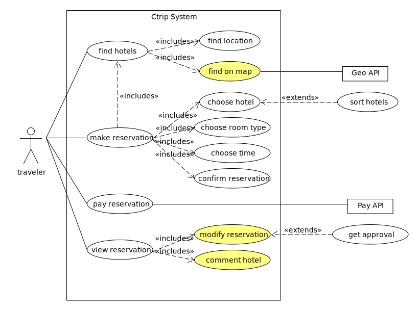
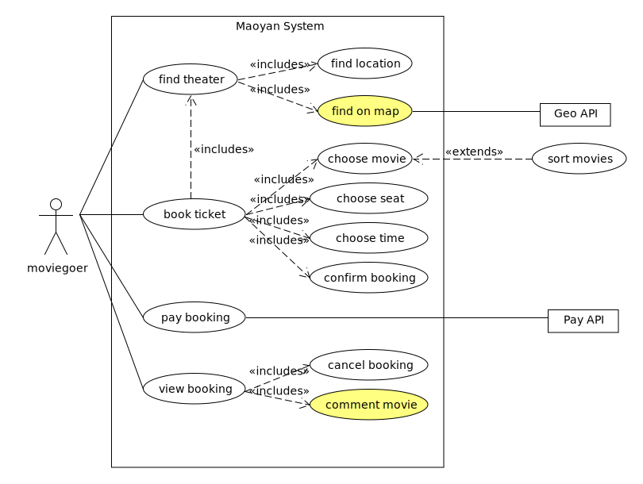

## 简答题

### 用例的概念
用例是软件工程或系统工程中对系统如何反应外界请求的描述，是一种通过用户的使用场景来获取需求的技术。每个用例提供了一个或多个场景，该场景说明了系统是如何和最终用户或其它系统互动，也就是谁可以用系统做什么，从而获得一个明确的业务目标。编写用例时要避免使用技术术语，而应该用最终用户或者领域专家的语言。用例一般是由软件开发者和最终用户共同创作的。

通俗地讲，用例就是一组相关的成功和失败场景集合，用来描述参与者如何使
用系统来实现其目标。

### 用例和场景的关系？什么是主场景或 happy path？
场景是参与者和系统之间的一系列特定的活动和交互，也称为用例实例，场景是使用系统的一个特定情节或用例的一条执行路径。

主成功场景(或happy path)是典型的、无条件的、理想方式、无错误的系统最基本的成功场景。

### 用例有哪些形式？
- 摘要

    简洁的一段式概要，通常用于主成功场景。
    - 何时使用？在早期需求分析过程中，为快速了解主题和范围。可能只需要几分钟进行编写。
- 非正式

    非正式的段落格式。用几个段落覆盖不同场景。
    - 何时使用？同上。
- 详述

    详细编写所有步骤及各种变化，同时具有补充部分，如前置条件和成功保证。
    - 何时使用？确定并以摘要形式编写了大量用例后，在第一次需求讨论会中，详细地编写其中少量(例如10%)的具有重要架构意义和高价值的用例。

### 对于复杂业务，为什么编制完整用例非常难？
由于复杂业务的场景较多，无法完整考虑各步骤的前置条件和成功保证，同时业务模式和需求容易变化，用例的编写需要遵循简洁的原则，如果用例过于完整，粒度太小，用例之间的关系会变得非常复杂，难以修改，缺乏灵活性，也容易出错。

### 什么是用例图？
用例图是指由参与者（Actor）、用例（Use Case）、边界以及它们之间的关系构成的用于描述系统功能的视图，可以展示系统边界、位于边界之外的事物以及系统如何被使用。

### 用例图的基本符号与元素？
- 执行者

    用例图显示了系统和系统外实体之间的交互。这些实体被引用为执行者。执行者代表角色，可以包括：用户，外部硬件和其他系统。执行者往往被画成简笔画小人。也可以用带«actor»关键字的类矩形表示。

    

    在下图中，执行者可以详细的泛化其他执行者:

    

- 用例

    用例是有意义的单独工作单元。它向系统外部的人或事提供一个易于观察的高层次行为视图。 用例的标注符号是一个椭圆。

    

    使用用例的符号是带可选择箭头的连接线，箭头显示控制的方向。下图说明执行者 "Customer"使用 "Withdraw"用例。

    

    用途连接器（uses connector）可以有选择性的在每一个端点有多重性值，如下图，显示客户一次可能只执行一次取款交易。但是银行可以同时执行许多取款交易。

    

- 用例定义

    一个典型的用例包括:
    
    - 名称和描述
    - 需求
    - 约束
    - 情形
    - 情形图
    - 附加信息。

- 名称和描述

    用例通常用一个动词词组定义，而且有一个简短的文字说明。

- 需求

    需求定义了一个用例必须提供给终端用户的正式功能性需求。它们符合构造方法建立的功能性规范。一个需求是用例将执行一个动作或提供多个值给系统的约定或承诺。

- 约束

    一个约束是一个用例运行的条件或限制。它包括：前置条件，后置条件和不变化条件 。前置条件指明了用例在发生之前需要符合的条件。后置条件用来说明在用例执行之后一些条件必须为"真"。不变化条件说明用例整个执行过程中该条件始终为"真"。

- 情形

    情形是用例的实例在执行过程中，事件发生流程的形式描述。它定义了系统和外部执行者之间的事件指定顺序。 通常用文本方式来表示，并对应顺序图中的文字描述。

- 包含用例

    用例可能包含其他用例的功能来作为它正常处理的一部分。通常它假设，任何被包含的用例在基本程序运行时每一次都会被调用。下面例子：用例“卡的确认”\<Card Identification\> 在运行时，被用例“取钱”\<Withdraw\>当作一个子部分。

    

    用例可以被一个或多个用例包含。通过提炼通用的行为，将它变成可以多次重复使用的用例。有助于降低功能重复级别。

- 扩展用例

    一个用例可以被用来扩展另一个用例的行为，通常使用在特别情况下。例如：假设在修改一个特别类型的客户订单之前，用户必须得到某种更高级别的许可，然后“获得许可”\<Get Approval\>用例将有选择的扩展常规的“修改订单”\<Modify Order\>用例。

    

- 扩展点

    扩展用例的加入点被定义为扩展点。

    

- 系统边界

    它用来显示用例在系统内部，执行者在系统的外部。

    

### 用例图的画法与步骤
- 确定研讨的系统
- 识别 Actors
    - 识别使用系统的主要参与者（primary actors）/角色(roles)
    - 识别系统依赖的外部系统
- 识别用例（服务）
    - 识别用户级别用例（user goal level）
    - 识别子功能级别的用例（sub function level）
- 建立 Actor 和 Use Cases 之间的关联

### 用例图给利益相关人与开发者的价值有哪些？
- 明确系统的业务范围、服务对象（角色）、外部系统与设备
- 帮助识别技术风险，提前实施关键技术原型公关与学习
- 易于评估项目工作量，合理规划迭代周期，规划人力需要

## 建模练习题（用例模型）
- 选择2个熟悉的类似业务的在线服务系统，订旅馆（携程）、订电影票（猫眼），绘制用例图。
    - 请使用用户的视角，描述用户目标或系统提供的服务 
    - 粒度达到子用例级别，并用 include 和 extend 关联它们
    - 请用色彩标注出你认为创新（区别于竞争对手的）用例或子用例
    - 尽可能识别外部系统和服务

    
    
    

- 然后，回答下列问题：
    - 为什么相似系统的用例图是相似的？
    
        相似系统的参与者（Actor）、用例（Use Case）、边界以及它们之间的关系相似，所以它们构成的用例图也相似。
    - 如果是定旅馆业务，请对比 Asg_RH 用例图，简述如何利用不同时代、不同地区产品的用例图，展现、突出创新业务和技术

        不同时代、不同地区用户习惯、需求、法规、外部系统和服务不同，使业务和技术有差异，用例图就会存在差别，用色彩标注它们，就可以展现出创新之处。
    - 如何利用用例图定位创新思路（业务创新、或技术创新、或商业模式创新）在系统中的作用

        看创新点在用例图的位置，如果是属于用户级别的用例，在系统中的作用就非常重要，如果是属于子功能级别的包含用例，也比较重要，如果是子功能级别的扩展用例或是外部系统或服务，作用就比较一般。
    - 请使用 SCRUM 方法，选择一个用例图，编制某订旅馆开发的需求（backlog）开发计划表

        |ID|Name|Imp|Est|How to demo|
        |-|-|-|-|-|
        |1|find hotel by location|8|1|input the hotel name to determine hotel|
        |2|find hotel on map|3|1|slide on map to determine hotel|
        |3|make reservation|7|4|determine hotel, room type, time and then confirm|
        |4|pay reservation|7|3|payment supported by third party system|
        |5|modify reservation|5|2|modify reservation and hotel make approval|
        |6|comment hotel|4|2|traveler rate and comment|
    - 使用用例点估算软件成本

        UAW =1×3(Complex)＝3

        UUCW＝5×5(Simple)+1×10(Average)＝35

        UUCP＝UAW+UUCW＝38

        TCF=0.6+(0.01×15)=0.75

        ECF=1.4+(-0.03×16.5)=0.905

        UCP=TCF×ECF×UUCP=25.7925 (26)
        
        UCP发明人建议：每UCP为16人~30人，均值为20人时，对一个规模为26个UCP的项目，所需要的开发工作量为Effort=UCP×Productivity=26×20=520人时，为13人周。
## 参考
https://sparxsystems.cn/resources/uml2_tutorial/uml2_usecasediagram.html  
http://t617.cn/blog/2018/04/18/lesson3.html  
www.ecice06.com/CN/article/downloadArticleFile.do?attachType=PDF&id=11259
